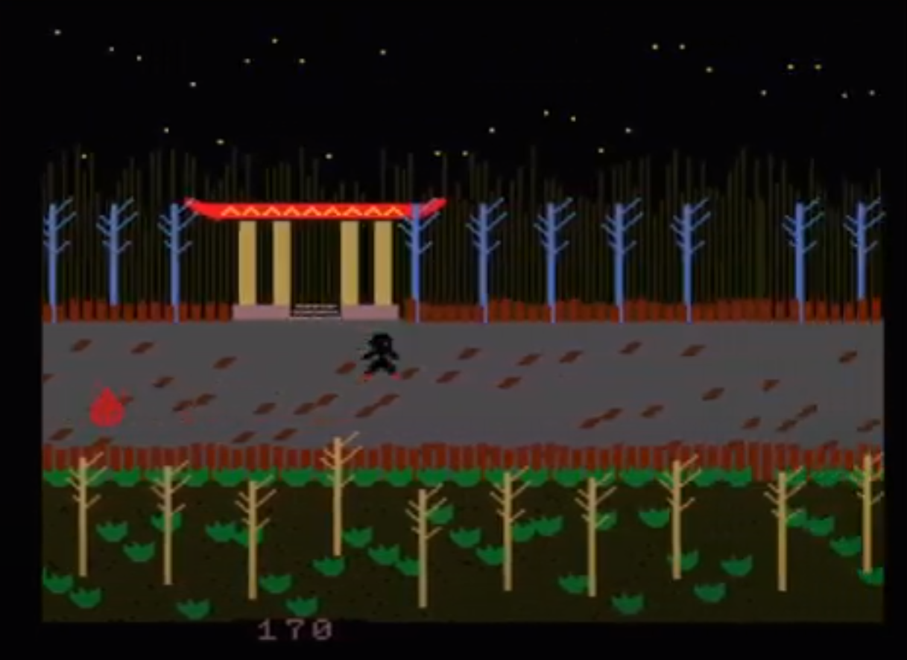

---
---

## Hi there :hand:

> My name is Juan Morales and I develop in my free time.

> Mi nombre es Juan Morales y programo en mis ratos libres.

I am a fan of the MSX system.
An 8-bit home microcomputer standard marketed during the 1980s.
What I like the most is MSX Basic programming.
I also make video games for VR basic.

Soy un seguidor del sistema MSX.
Un estándar de microordenador doméstico de 8 bits comercializado durante los años 1980.
Lo que más me gusta es la programación MSX Basic.
También hago videojuegos para VR basic.

---
---

## Contact

<!-- twitter: https://twitter.com/Juanmoralesgui1 -->

<!-- youtube: https://www.youtube.com/@JuanMorales-sf1ll -->

<!-- github: https://github.com/juanmoralesdev -->

<!-- mailto:Juanmoralesgui@gmail.com -->

---
---

## My games

### Aland Returns 

<!--2023-->

<a href="https://www.youtube.com/watch?v=MWiq-YC4OyU" target="_blank">Video</a> | 
<a href="https://juanmoralesmsx.github.io/alandreturns/?disk=games/Aland.dsk" target="_blank">Play</a> | 
<a href="https://github.com/juanmoralesdev/Aland-returns" target="_blank">Proyect</a> | 
<a href="https://github.com/juanmoralesdev/Aland-returns/releases/tag/v1.0.0" target="_blank">Download</a>

---

### The Hole

<!--2022 --> 

<a href="https://www.youtube.com/watch?v=XQc4_OUd9x0" target="_blank">Video</a> | 
<a href="https://juanmoralesmsx.github.io/juanmoralesdev/?disk=games/THE-HOLE.dsk" target="_blank">Play</a> | 
<a href="" target="_blank">Proyect</a> | 
<a href="" target="_blank">Download</a>

---

Survival Rooms 2021

<!--2021-->

<a href="https://www.youtube.com/watch?v=XQc4_OUd9x0" target="_blank">Video</a> | 
<a href="https://juanmoralesmsx.github.io/juanmoralesdev/?disk=games/survival.dsk" target="_blank">Play</a> | 
<a href="" target="_blank">Proyect</a> | 
<a href="" target="_blank">Download</a>

---

### Troubled River 

<!--2021-->

<a href="https://www.youtube.com/watch?v=MWiq-YC4OyU" target="_blank">Video</a> | 
<a href="https://juanmoralesmsx.github.io/juanmoralesdev/?disk=games/troubleriver.dsk" target="_blank">Play</a> | 
<a href="" target="_blank">Proyect</a> | 
<a href="" target="_blank">Download</a>

---

### The Nurse 

<!--2021-->

<a href="https://www.youtube.com/watch?v=2sB6jocbDIw" target="_blank">Video</a> | 
<a href="https://juanmoralesmsx.github.io/juanmoralesdev/?disk=games/thenurse.dsk" target="_blank">Play</a> | 
<a href="" target="_blank">Proyect</a> | 
<a href="" target="_blank">Download</a>

---

### Demonia

<!--2020-->

<a href="https://www.youtube.com/watch?v=whEHgEa8UXA&t=558s" target="_blank">Video</a> | 
<a href="https://juanmoralesmsx.github.io/juanmoralesdev/?disk=games/Demonia.dsk" target="_blank">Play</a> | 
<a href="" target="_blank">Proyect</a> | 
<a href="" target="_blank">Download</a>

---

### Tamari

<!--2021-->

<a href="https://www.youtube.com/watch?v=SqCZQ0ySv5U&t=58s" target="_blank">Video</a> | 
<a href="https://juanmoralesmsx.github.io/juanmoralesdev/?tape=games/TAMARI.cas" target="_blank">Play</a> | 
<a href="" target="_blank">Proyect</a> | 
<a href="" target="_blank">Download</a>

---

### Aventuras de Tristán 

<!--2019-->

https://www.youtube.com/watch?v=4H9XX8egUHk&t=330s

<a href="https://www.youtube.com/watch?v=SqCZQ0ySv5U&t=58s" target="_blank">Video</a> | 
<a href="https://juanmoralesmsx.github.io/juanmoralesdev/?tape=games/tristan.cas" target="_blank">Play</a> | 
<a href="" target="_blank">Proyect</a> | 
<a href="" target="_blank">Download</a>

---

### Atrapado en la Mina

<!--2019-->

<a href="https://www.youtube.com/watch?v=e07z883E8AM" target="_blank">Video</a> | 
<a href="https://www.msxgamesworld.com/software-emulator.php?id=5607" target="_blank">Play</a> | 
<a href="" target="_blank">Proyect</a> | 
<a href="" target="_blank">Download</a>

---

### Ghost Park

<!--2019-->

<a href="https://www.youtube.com/watch?v=tGlfpq3yZWM" target="_blank">Video</a> | 
<a href="https://juanmoralesmsx.github.io/juanmoralesdev/?tape=ghost-park.cas" target="_blank">Play</a> | 
<a href="" target="_blank">Proyect</a> | 
<a href="" target="_blank">Download</a>

---

### Ninja relove

<!--2019-->

<a href="https://www.youtube.com/watch?v=tGlfpq3yZWM" target="_blank">Video</a> | 
<a href="https://juanmoralesmsx.github.io/juanmoralesdev/?tape=ninja-relove.dsk" target="_blank">Play</a> | 
<a href="" target="_blank">Proyect</a> | 
<a href="" target="_blank">Download</a>

